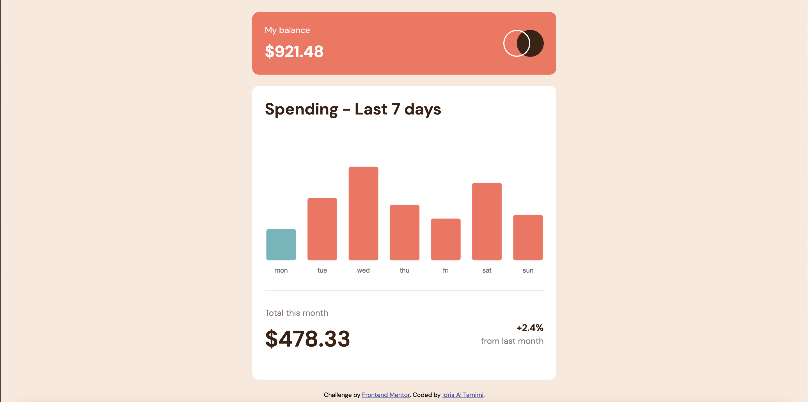
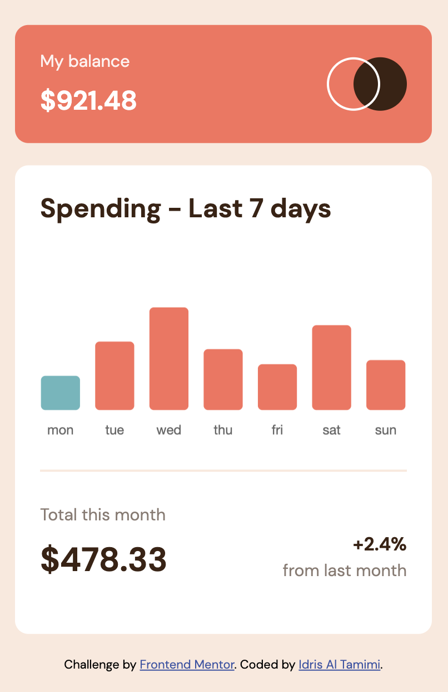
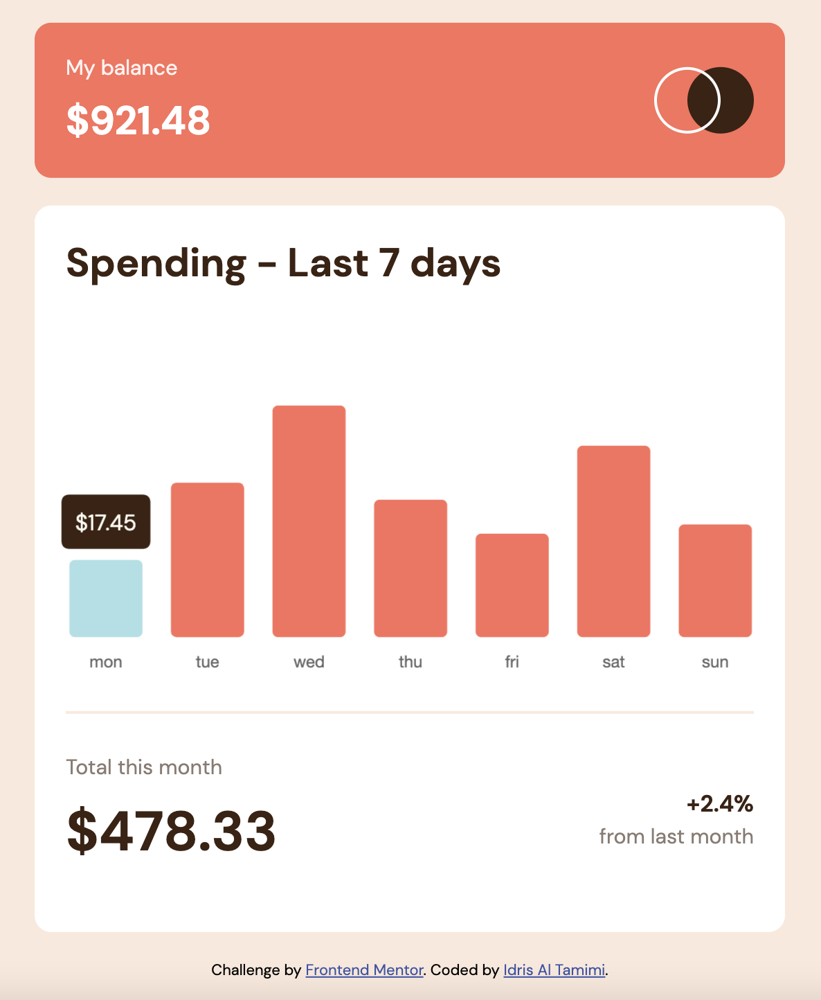
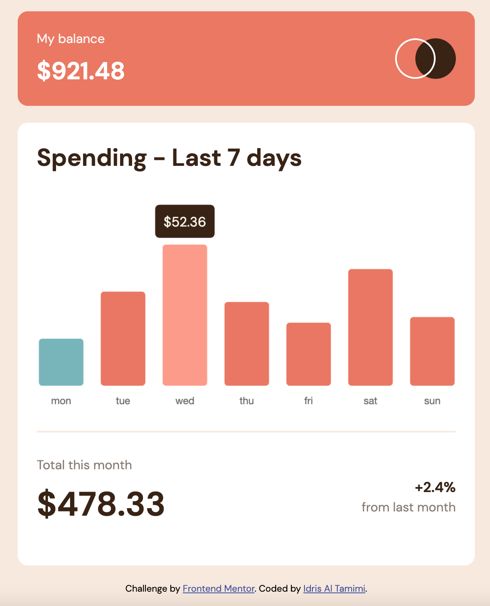

  

# Frontend Mentor - Expenses chart component solution

  

This is a solution to the [Expenses chart component challenge on Frontend Mentor](https://www.frontendmentor.io/challenges/expenses-chart-component-e7yJBUdjwt). Frontend Mentor challenges help you improve your coding skills by building realistic projects.

  

## Table of contents

  

- [Overview](#overview)

- [The challenge](#the-challenge)

- [Screenshot](#screenshot)

- [Links](#links)

- [My process](#my-process)

- [Useful resources](#useful-resources)

- [Author](#author)

  

  

## Overview

  

### The challenge

  

Users should be able to:

  

- View the bar chart and hover over the individual bars to see the correct amounts for each day

- See the current day’s bar highlighted in a different colour to the other bars

- View the optimal layout for the content depending on their device’s screen size

- See hover states for all interactive elements on the page

- **Bonus**: Use the JSON data file provided to dynamically size the bars on the chart

  

### Screenshot

  

  

### Links

  

- Solution URL: [GitHub Repository Link](https://github.com/idrisaltamimi/expenses-chart-component.git)

- Live Site URL: [Live Site](https://idrisaltamimi.github.io/expenses-chart-component/)

  

## My process

  

### Built with

  

- HTML5

- CSS

- Chartjs

- JavaScript

  

### Useful resources

  

- [Chart.js documentation](https://www.chartjs.org/docs/3.8.0/) - This helped me create a chart for the project.

  

## Author

  

- GitHub - [Idris Al Tamimi](https://github.com/idrisaltamimi)

  

- Frontend Mentor - [@idrisaltamimi](https://www.frontendmentor.io/profile/idrisaltamimi)

  

- Twitter - [@idris_altamimi](https://twitter.com/idris_altamimi)
